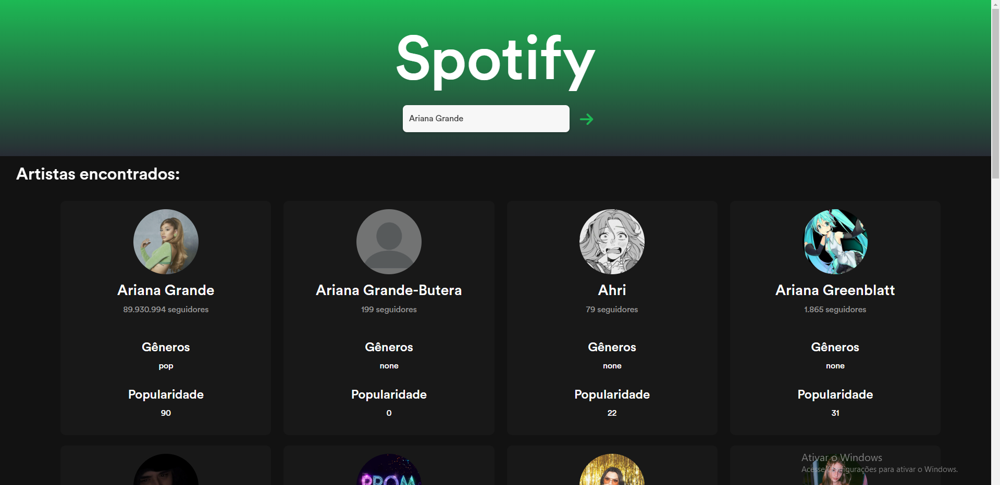

.

#### Daploy

https://elc1090.github.io/project2a-gilson-e-roberto/

#### Desenvolvedor

Gilson Garcia

#### Ambiente de desenvolvimento
- VS Code
- Insomnia

#### Créditos
- [Spotify Web API](https://developer.spotify.com/documentation/web-api)
- [Last.fm API](https://www.last.fm/api)
- [React.js](https://react.dev/)
- [Bootstrap](https://react-bootstrap.github.io/)
- [ChatGPT](https://openai.com/blog/chatgpt)

#### Bastidores

Este trabalho foi motivado principalmente por dois fatores. O primeiro e mais importante, meu interesse em aprender React e o segundo, meu outro interesse em brincar um pouco com animações em CSS e HTML. Este trabalho foi de grande proveito, pois não se me oportunou pôr em prática essas duas vontades como serviu de motor para busca de outros conhecimentos. Lidei com construção de um projeto do 0, compreendendo sua estrutura e flexibilidade. Foi possível também ter contato com áreas antes não vistas nas ferramentas que já tenho contato atualmente, como Vue.js. Existe uma grande diferença entre os dois frameworks e trabalhar com React me possibilitou ver as coisas por outra perspectiva. 

Tendo isso em mente, o trabalho foi desenvolvido com bastante empenho buscando ao máximo explorar todas essas áreas. Precisei fazer bastante pesquisa nas documentações do framework, bibliotecas necessárias, e das APIs utilizadas. Tive um pouco de dificuldade em trabalhar com rotas em React, mas no fim tudo deu certo.

---
Projeto entregue para a disciplina de [Desenvolvimento de Software para a Web](http://github.com/andreainfufsm/elc1090-2023a) em 2023a
